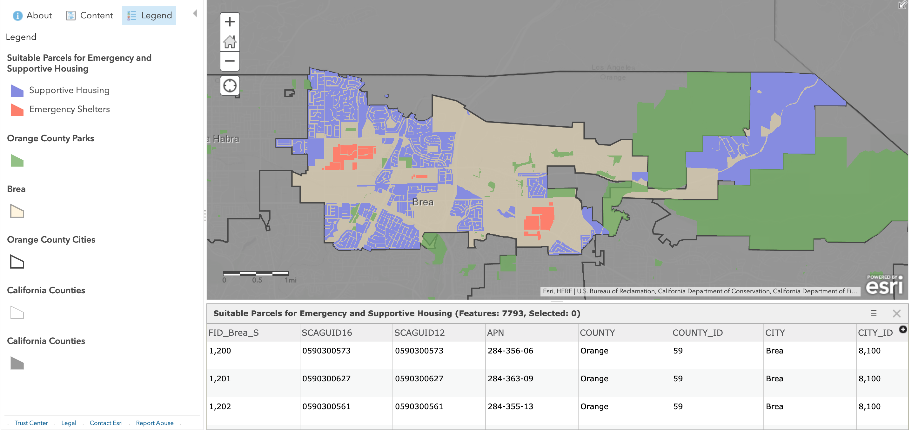
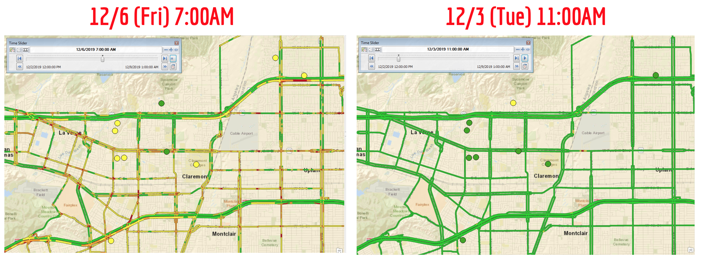

# EA101: Geographical Information Systems

Author: Jasmine Seo

This repository includes sample work from EA101, taken at Pomona College in Fall 2019, as a part of my Environmental Analysis Emphasis (minor). In this course, I learned fundamental GIS concepts, such as geocoding, raster data, and geodata management, and utilized GIS tools (ArcGIS Online, ArcMap v10.6).

## Projects

### Potential Homeless Shelter Locations in Orange County, CA
I contributed to an open sourced project to identify possible locations for homeless shelters and emergency housing in Orange County (OC), California. This was inspired by a [similar project](https://voiceofoc.org/2018/04/orange-countys-homeless-shelters-and-potential-emergency-housing-zones/) conducted by an OC news outlet, Voice of OC. The GIS layer indicates the possible housing locations in Brea, CA in compliance with the city's regulations and zoning policies. The result was an mxd file on ArcGIS Desktop 10.6 and was later shared as an ArcGIS Online [Web map](https://arcg.is/14uPTT0).

<p align="center">
  
</p>


### Traffic & Air Quality in Claremont, CA
Beyond the class's curriculum, I wanted to explore temporal data, geospatial statistics, and animations with GIS. In relation to my senior capstone project, I visualized the correlation of car traffic and air pollution. I collected Particulate Matter (PM) levels in my area from [PurpleAir](https://www.purpleair.com/map)'s public, crowdsourced air quality map. After data cleaning in R, I overlayed with traffic estimations (from ESRI's World Traffic Service) and created an [animation](https://youtu.be/G-z4RaVTrus) of city-level traffic and air quality patterns over time. As below, bad air quality (high PM readings represented in yellow circles at sensor locations) coincided with traffic congestion (represented in yellow and red streets), and vice versa with low traffic time periods. In addition, I created spatial interpolations of air quality levels.

<p align="center">
  
</p>


## Repository Structure
```
├── OCMapping_Brea
│   ├── Documentation
│   ├── ArcMap                      # gdb, mxd files
│   ├── SourceData                  # shp files of input layers
│   ├── AnalyzedData                # shp files of output layers
│   ├── Exported
│   └── Final                       # final mxd file
├── Traffic_AirQuality_Claremont
│   ├── Documentation               # R script for data processing  
│   ├── ArcMap                      # gdb, mxd files
│   ├── SourceData                  # air quality data
│   ├── AnalyzedData
│   ├── Exported            
│   └── Final                       # snapshots of animation, interpolation
├── EA101_Final_Presentation.pdf    # summary of Traffic & Air Quality Project
├── EA101_Lab.pdf                   # smaller samples of GIS exploration
└── README.md
```
